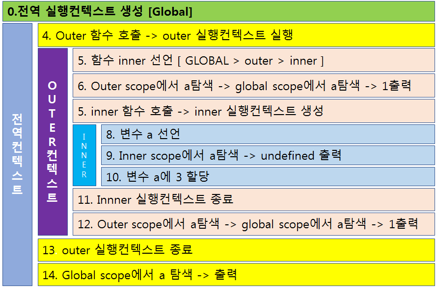

```js

var name = "foo";

function wow(word) {
  console.log(word + '' + name);
}

function say() {
  var name = 'bar'
  console.log(name);
  wow('Hello');
}

say();

//result : bar , hello foo


```

## Context 원칙 4가지
1. 전역 컨텍스트 하나 생성 후, 함수 호출 시마다 컨텍스트가 생김
2. 컨텍스트 생성 시 컨텍스트 안에 변수객체(argument,variable), scope chin, this가 생성됨
3. 컨텍스트 생성 후 함수가 실행되는데, 사용되는 변수들은 변수 객체 안에서 값을 찾고, 없다면 스코프체인을 따라 올라가며 찾는다
4. 함수 실행이 마무리되면 해당 컨텍스트는 사라진다.(클로저 제외) 페이지가 종료되면 전역 컨텍스트가 사라짐

## Hoisting

호이스팅이란 변수를 초기화했을 때 선언부분이 최상단으로 끌어올려지는 현상을 의미
함수 표현식이 아니라 함수 선언식일 때는 식 자체가 통째로 끌어올려짐.

```js

console.log(zero); // 에러가 아니라 undefined
sayWow(); // 정상적으로 wow
function sayWow() {
  console.log('wow');
}
var zero = 'zero';


```


## Closure Function

Function Scope 밖의 자유변수를 참조

```js
var counter = function() {
  var count = 0;
  function changeCount(number){
    count += number;
  }

  return {
    increase : function() {
      counter(1);
    },
    decrease : function() {
      counter(-1);
    },
    show : function() {
      console.log(count);
    }

  }
}

var counterClosure = counter();
counterClosure.increase();
counterClosure.show() // 1
counterClosure.decrease();
counterClosure.show() // 0

```


```js

var a = 1;
function outer() {
  console.log(a);

  function inner() {
    console.log(a);
    var a = 3;
  }

  inner();

  console.log(a);
}

outer();
console.log(a);

```

